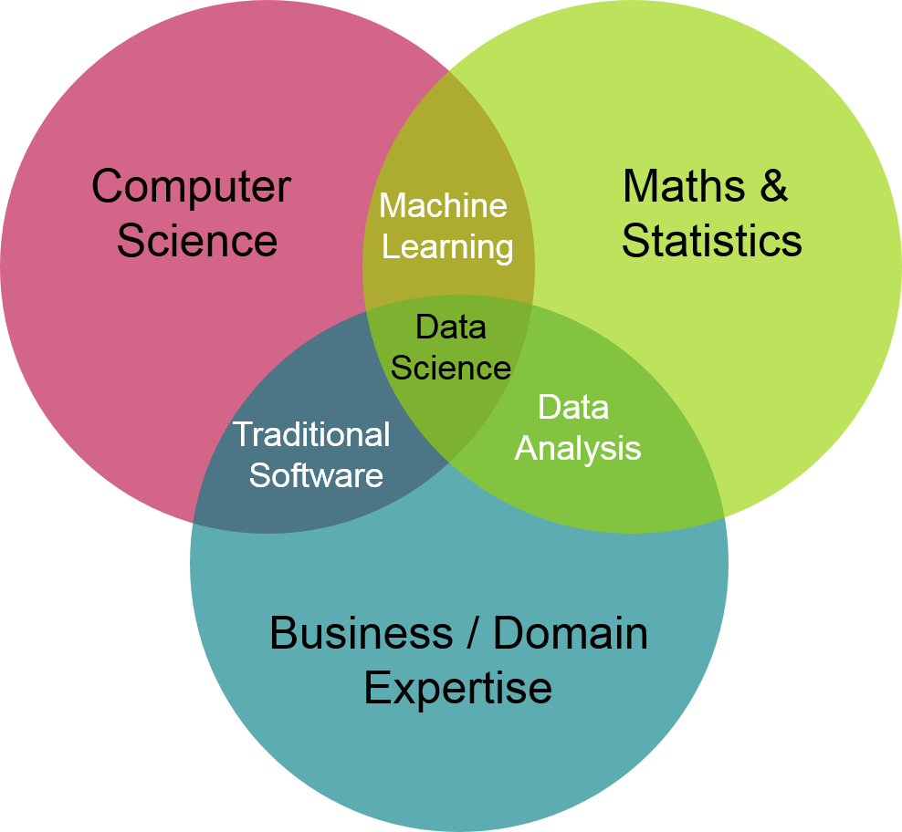

# _Analysis of the plain bearings measurements results using data science methods._

## 1. Defining the purpose of the thesis.

The main objective of this paper is an attempt to use the tools provided by Data Science to analyze data from measurements made for research work in mechanical engineering.

In some applications, a conventional data analysis methods for machnical engineering are beginning to be insufficient and a limitation to obtaining the best possible conclusions from measurements. Here it would be useful to look around at what data analysis capabilities heve been developed in recent years and try to implement them for mechanical engineering. The leading branch of science focusing on data analysis in recent years is actually Data Science and it seems that using the tools that have been developed there can bring a lot of benefits to processing measurments data. 

Data science methods are not limited by the existing software - one can freely shape the interface and use any statistical tools, data science tools based on python and R libraries are optimised for processing large databases, use of machine learning methods is increasingly used to make predictions based on previous experiences.

### 1.1 Preliminary definition of Data Science

To begin with, it seems appropriate to give an overview of what Data Science is, the origin of this branch of science and what branches of science it is related to. The following diagram (Fig. 1) can be useful for this purpose; it shows the overlap of the branches of science that data science combines.

<figure align="center">
  
  <figcaption align = "center">
    <i>Fig.1 Data Science graph. [1]</i>
  </figcaption>
</figure>

One can then recall a short definition, the unfolding of which, combined with the diagram above, should give a fairly good intuition about the complexity of this domain.

> "Data science combines the scientific method, math and statistics, specialized programming, advanced analytics, AI, and even storytelling to uncover and explain the business insights buried in data." [2]

First of all Data Science is the domain of study that deals with vast volumes of data which are collected from different sources. Here we are dealing with the lowest circle in the diagram (Fig. 1), the data can come from a business that wants to analyze its actions (for example, it can be traffic data from a store's website, or gps data from trucks of a transport company) or from specialized research from which we want to draw the greatest insight. The data used for analysis can be from multiple sources and present in various formats.

Data Science uses modern tools and techniques that come from both circles of the top graph (Fig 1.). Techniques derived from mathematics and statistics provide long-established capabilities for computing, analyzing, and processing data. Computer science, on the other hand, provides the ability to perform these calculations on large data sets and curate machine learning algorithms to build predictive models. 

The combination of all this gives  the ability to find unseen patterns, extract meaningful information and make business decisions that would not be possible with conventional solutions.

The above short definition shows that it is a field of science which takes a multidisciplinary approach and is aimed at the most accessible presentation of data in a business environment where it is often necessary to show the results of some actions to people who are not involved in a given field. Using these methods focuses on getting the most utility out of data, which in today's world is a large and often growing set.  

This short introduction will be developed in one of the following chapters (Chapter 4) where aspects such as: lifecycles, tools, use cases and more will be presented in depth.

### 1.2 Acquisition of measurement data for analysis

Thanks to the possibility of cooperation with the department of mechanical engineering, it was possible to obtain data resulting from the work on sliding bearings that they conduct. Initial discussions revealed a need to expand the range of tools for analyzing the data obtained from this research for reasons discussed in more depth in section 2 of this thesis. Thanks to this possibility, it was possible to obtain real data from measurements and there was no need to create measurements or even simulate what measurements would be just to complete this paper.

Another advantage will be the possibility of comparing the results of analyses based on data science methods to analyses conducted by a unit that deals with these bearings on a daily basis, and possibly supporting their work with tools that can be selected in further stages of this work. In the case of the team that deals with these measurements, they have already been in contact with data scientists from outside the university in the form of orders to create software for processing data from specific measurements. From this point of view, it seems all the more reasonable to combine efforts to explore the topic of data analysis using data science methods.

### 1.3 Methodology for the analysis

The preliminary idea of the work presented in this paper is to analyze the results of measurements using selected data science methods and to compare these results with the results of analysis performed using conventional methods of mechanical measurement analysis that have been used so far by the team who perform the measurements.

## 2. Identifying problems that arise with the collection of an increasing amount of measurement data.

Improvements in the quality of measuring instruments and increase in their precision allow us to perform measurements with increasing accuracy and resolution. Thus, the amount of data that we obtain from measurements is also growing and it seems that this trend will continue in the coming years. Hence, there is a need to increase the possibility of processing these data, preferably in a complete free way ang giving the flexibility to choose tools for their analysis from the wildest possible spectrum. In such a way as to be able to adopt to the incoming new data in case of a desire to extend measurements or change the measuring equipment and thus add new output results or possibility of adopting a different data structure.

Data processing methods, which have been used so far in the process of measurment in mechanical engineering starts to limit possibilities of extracting the greatest possible amount of informations from the measurments.

## 3. Searching for available methods of data analysis already used in mechanical engineering.

When looking for a reference point, it is necessary to trace the software used so far for analyzing the measurement data. In order to narrow down the spectrum, the focus has been on the software used to date to process data from plain bearings measurements which will later be analyzed using data science methods. 

### 3.1 Excel (Microsoft)

Some initial text.

<figure align="center">
  
  <figcaption align = "center">
    <i>Fig.2 GUI of Excel software. [7]</i>
  </figcaption>
</figure>

> "Microsoft Excel provides a grid interface to organize nearly any type of information.  The power of Excel lies in it's flexibility to define the layout and structure of the information you want to manage.  Basic tasks require no special training, and Excel allows you to work with text, numbers, and date information in a relatively open and unstructured way.  Nearly 30 years after it's initial introduction, Excel remains the worlds leading spreadsheet software." [6]

### 3.2 Origin (OriginLab)

Origin is GUI based software aimed at scientists and therefore has a lot of capabilities often needed for measurement analysis. The software has a lot of available options, add-ons and possibilities to work with other programs.

<figure align="center">
  
  <figcaption align = "center">
    <i>Fig.2 GUI of Origin software. [4]</i>
  </figcaption>
</figure>

> "**Origin** is the data analysis and graphing software of choice for over half a million scientists and engineers in commercial industries, academia, and government laboratories worldwide. Origin offers an easy-to-use interface for beginners, combined with the ability to perform advanced customization as you become more familiar with the application. **Origin** graphs and analysis results can automatically update on data or parameter change, allowing you to create templates for repetitive tasks or to perform batch operations from the user interface, without the need for programming. Extend the capabilities in Origin by installing free Apps available from our website." [4]

### 3.3 LabVIEW (NI)

LabVIEW is used to create a measurement strategy, build a test bench, and quickly view real-time data. Its capabilities are quite broad and it is a good test environment because of the ease of making changes and access to simple visualization methods immediately after measurements.

<figure align="center">
  
  <figcaption align = "center">
    <i>Fig.2 GUI of LabVIEW software. [5]</i>
  </figcaption>
</figure>

> "LabVIEW is systems engineering software for applications that require test, measurement, and control with rapid access to hardware and data insights. LabVIEW offers a graphical programming approach that helps you visualize every aspect of your application, including hardware configuration, measurement data, and debugging. This visualization makes it simple to integrate measurement hardware from any vendor, represent complex logic on the diagram, develop data analysis algorithms, and design custom engineering user interfaces." [5]

### 3.4 Solartron Metrology

In this particular case, one of the software that will be used in this research work will be a detector program from Solartron Metrology. Due to the measuring devices used, the program is needed to process the output signals from the measuring devices. The signal that arrives at the computer is then processed by the software and prepared for further analysis in the form of files such as .cvs. There is a simple interface here both to control the sampling method and to adjust the format of the output data. In the following discussion the role of the software from Solartron will be omitted because the focus is on the analysis of the data itself and not on the way of conducting the measurements.

## 4. Presentation of the general outline of data science methods and the possibility of using them to analyze measurements.

### 4.1 Data science

### 4.2 Lifecycle of data science project

When it comes to how a project is run in data science, there is a term called project lifecycle. This may differ in the way it is described as well as in the specific points depending on the source where you look for information about the project lifecycle, but in principle the main steps will be similar:

1. Understanding problem
2. Data collection
3. Data cleaning and processing
4. Exploratory data analysis
5. Model building and evaluation
6. Comunicating model results
7. Model deployment and maintenance

### 4.3 Tools

### 4.4 Use cases

## 5. Measurements of plain bearings at available test stands.

## 6. Use of data science methods to analyze obtained data from plain bearing measurements.

## 7. Development of the analysis results and conclusions.

## 8. Bibliography

[1] https://thedatascientist.com/data-science-without-programming/

[1] https://towardsdatascience.com/data-science-101-life-cycle-of-a-data-science-project-86cbc4a2f7f0

[2] https://www.ibm.com/cloud/learn/data-science-introduction

[3] https://www.simplilearn.com/tutorials/data-science-tutorial/what-is-data-science

[4] https://www.originlab.com/index.aspx?go=PRODUCTS/Origin

[5] https://www.ni.com/pl-pl/shop/labview.html

[6] https://www.opengatesw.net/ms-excel-tutorials/

[7] https://www.microsoft.com/en-us/microsoft-365/blog/2019/02/06/excel-with-microsoft-excel-in-office-365/

[8]

[10] A. Geron, _Hands-On Machine Learning with Scikit-Learn and TensorFlow_, O'Reilly Media, Inc., 2017

[11] P. Bruce, A. Bruce, _Practical Statistics for Data Scientists_, O'Reilly Media, Inc., 2017

[12] J. VanderPlas, _Python Data Science Handbook_, O’Reilly Media, Inc., 2017

